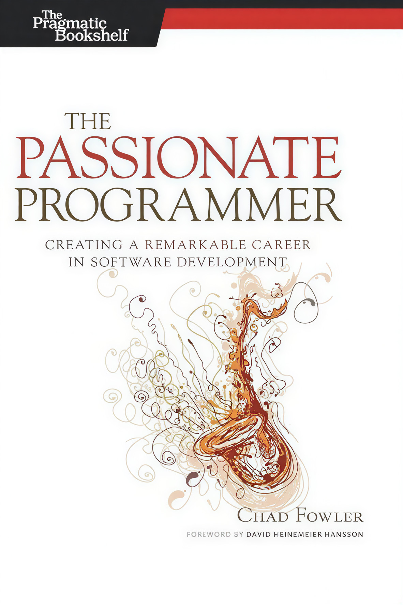

  

<h1 align="center"> ترجمه فارسی کتاب The Passionate Programmer</h1>

  راهنمای عملی برای ساختن یک مسیر شغلی «قابل‌توجه» در توسعه نرم‌افزار — نوشتهٔ <b>Chad Fowler</b>

  
  
  
  
  

<h1>

   <a href="https://hheydarian.github.io/Gitab/" target="_blank"><strong>گیتاب — نسخه آنلاین ترجمه</strong></a>

</h1>

---

## ✨ معرفی پروژه

کتاب **The Passionate Programmer** یکی از کتاب‌های کلاسیک مجموعه Pragmatic است که به‌جای تمرکز صرف روی کدنویسی، روی **ساختن یک مسیر شغلی موفق در دنیای توسعه نرم‌افزار** تمرکز می‌کند.

ایده‌ی اصلی کتاب خیلی روشن است:
شغل شما هم مثل یک «محصول» است — باید برایش **بازار، استراتژی، سرمایه‌گذاری، اجرا، بازاریابی و حفظ مزیت رقابتی** داشته باشید.

این ریپازیتوری تلاشی‌ست برای ارائهٔ یک نسخهٔ فارسی، دقیق و خوانا از این کتاب برای جامعهٔ برنامه‌نویسان فارسی‌زبان 🚀

---

## ⚙️ پیش‌نیاز مطالعه

🔹 آشنایی پایه با برنامه‌نویسی کافی است — این کتاب بیشتر «تفکر شغلی/حرفه‌ای» را هدف می‌گیرد.  
🔹 برای تجربهٔ خوانایی بهتر در مرورگر، پیشنهاد می‌کنیم افزونهٔ [فونت ایران](https://chromewebstore.google.com/detail/fontiran/edbchgkbejkdkdkpgenlaciegoidmjoh) را نصب کنید.

---

## 🙌 راه‌های مشارکت

از مشارکت شما واقعاً استقبال می‌کنیم. چند راه ساده برای کمک:

- 🔎 **بازبینی و اصلاح ترجمه‌های فعلی**
- ✍️ **پیشنهادهای ادبی برای روان‌تر شدن متن**
- 💡 **پیشنهادهای فنی برای دقیق‌تر شدن اصطلاحات**
- 🎨 **بهبود فرمت‌دهی Markdown برای خوانایی بیشتر**

> بهترین راه: یک Issue باز کنید یا Pull Request بفرستید 🌱

---

## 🔗 فصل‌های کتاب (با لینک)

| شماره | نام بخش/فصل (انگلیسی)                              | نام بخش/فصل (فارسی)                                  | وضعیت | لینک |
|------:|-----------------------------------------------------|-------------------------------------------------------|:-----:|------|
| 00    | Foreword                                             | پیش‌گفتار                                             | ✅ | [Foreword](Book/00/Foreword.md) |
| 00.1  | Acknowledgments                                      | قدردانی / سپاسگزاری‌ها                                | ✅ | [Acknowledgments](Book/00_1/Acknowledgments.md) |
| 00.2  | Introduction                                         | مقدمه                                                 | ✅ | [Introduction](Book/00_2/Introduction.md) |
| 01    | Choosing Your Market                                 | انتخاب بازار (مسیر درست برای رشد)                     | ✅ | [Choosing Your Market](Book/01/Choosing_Your_Market.md) |
| 02    | Investing in Your Product                             | سرمایه‌گذاری روی محصول (خودِ شما)                      | ✅ | [Investing in Your Product](Book/02/Investing_in_Your_Product.md) |
| 03    | Executing                                            | اجرا کردن (از حرف تا عمل)                             | ✅ | [Executing](Book/03/Executing.md) |
| 04    | Marketing... Not Just for Suits                      | بازاریابی… نه فقط برای کت‌وشلواری‌ها                  | ✅ | [Marketing](Book/04/Marketing.md) |
| 05    | Maintaining Your Edge                                | حفظ برتری (به‌روز ماندن و مزیت رقابتی)                | ✅ | [Maintaining Your Edge](Book/05/Maintaining_Your_Edge.md) |

---

## 🧩 اصول ساختاری پروژه

- تمام فصل‌ها با فرمت `.md` نوشته شده‌اند
- تصاویر در مسیر `assets/` نگهداری می‌شوند
- برای بهتر نوشتن/ویرایش کردن: یادگیری [Markdown](https://markdown-fa-book.vercel.app/)

---

## 🛡️ مجوز و حقوق نشر

<ul dir="rtl">
  <li><b>حقوق نشر و کپی‌رایت کتاب اصلی:</b> متعلق به نویسنده (Chad Fowler) و ناشر اصلی است.</li>
  <li><b>مجوز مخزن:</b> این ریپو دارای فایل <code>LICENSE</code> با مجوز <code>MIT</code> است (برای ساختار/فایل‌های پروژه).</li>
  <li><b>متن ترجمه:</b> اگر قرار باشد مثل ریپوهای قبلی شفاف‌سازی شود، می‌توان متن ترجمه را تحت مجوز <code>CC BY-NC-SA 4.0</code> منتشر کرد (در صورت نیاز، با افزودن فایل مجوز جدا برای ترجمه).</li>
</ul>

---

## 🌟 قدردانی

سپاس از همهٔ کسانی که برای رشد دانش نرم‌افزار در جامعهٔ فارسی‌زبان وقت می‌گذارند.  
هر پیشنهاد شما، این ترجمه را دقیق‌تر و خواناتر می‌کند 💚

---

ساخته شده با ❤️ توسط حامد برای برنامه‌نویسان

